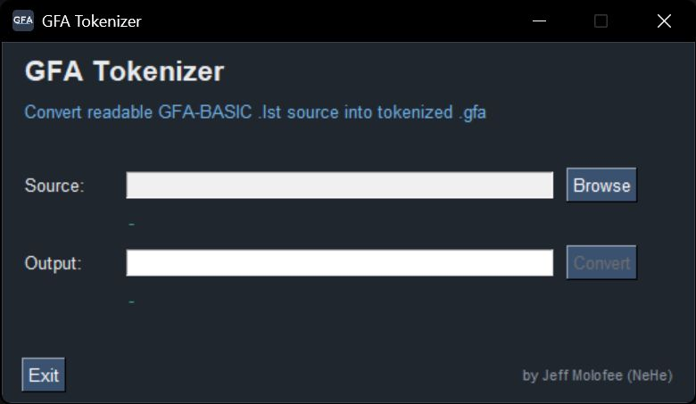

# GFA Tokenizer for PC



**Direction: `.lst` -> `.gfa`** (readable source in, tokenized binary out). For the reverse direction (`.gfa` -> `.lst`), see the companion [GFA Detokenizer](https://github.com/) project.

Converts readable GFA-BASIC `.lst` source listings into the tokenized `.gfa` binary format the Atari ST GFA-BASIC editor loads and saves — the reverse of the companion GFA Detokenizer project. Produced files can be loaded into the real GFA-BASIC editor and compiled with the real compiler.

## Requirements

- Python 3.10+
- Optional: PySimpleGUI (`pip install PySimpleGUI`) — enables GUI mode

## Usage

**Windows:** Double-click `start_app.bat` — it creates a local `.venv` and installs dependencies from `requirements.txt`, then launches the app. Command-line arguments are passed through, e.g. `start_app.bat source.lst`.

**GUI:** run with no arguments. Source is Browse-only (pick a `.lst` file). Output defaults to the same name with a `.gfa` extension in the same folder as the source, and is freely editable before you click Convert.

**Manual (any platform):**

```
python gfa_tokenizer.py source.lst
python gfa_tokenizer.py source.lst -o output.gfa
```

## Building a standalone .exe

`build.bat` builds `dist\GFA Tokenizer.exe` via PyInstaller (no console window, custom icon).

## How It Works

1. Writes the fixed 164-byte header: a 38-entry pointer table (`sep[]`) giving the byte bounds of the identifier pool and the program listing, matching the layout the companion Detokenizer project reverse-engineered.
2. Scans each source line, building the 16-group identifier pool (one group per variable/array/label/procedure sigil) as new names are discovered, in first-use order.
3. Encodes each line into `[lcp keyword code][statement-specific header bytes][token-stream bytes]`, using the same keyword/operator tables the Detokenizer uses (`gfa_token_tables.json`, from [gfalist](https://github.com/mmuman/gfalist) by Peter Backes, GPL-2.0).
4. Indentation in the source `.lst` is informational only and is not written anywhere — the tokenized format never stores it; the real editor re-derives display indentation purely from each line's `lcp` code when it loads the file.

Verified by round-tripping generated `.gfa` files back through the companion Detokenizer and checking the output matches the original source, including a program exercising a string variable, string literal, `IF`/`ENDIF`, and a `FOR`/`NEXT` loop. Also verified by actually loading and compiling a generated `.gfa` in the real GFA-BASIC editor and compiler under emulation (Hatari) — the stronger check that caught six real encoding bugs no amount of round-tripping through this project's own tokenizer/detokenizer pair alone ever could, since that pair is lenient about things the real editor rejects outright (see Known Limitations' changelog note below).

## Supported Constructs (current coverage)

- Scalar assignment (`x%=5`, `y$="text"`, all six sigils: `#` `$` `%` `!` `&` `|`, with or without an explicit `LET`) and **array-element assignment** (`a%(i)=5`, index expression can be arbitrary), with a full expression on the right-hand side (arithmetic, comparisons, function/built-in calls, string literals, numbers in decimal/`&H`/`&O`/`&X`). Array-element *reads* work anywhere an expression is expected (e.g. `y%=a%(0)+3`).
- Every built-in function/operator in the keyword tables, including the ones whose names collide with the array-reference sigils (`STR$(`, `CHR$(`, `OCT$(`, `MID$(`, `SHL&(`, and the ~30 others like them) — these resolve as the built-in, not a same-named user array.
- `MID$(str$,pos,len)=value$`, the in-place substring-assignment statement form (distinct from `MID$(` used as a read-only function).
- `DIM`, `ARRAYFILL`.
- `IF`/`ENDIF`/`ELSE`/`ELSE IF`, `DO`/`LOOP`, `DO WHILE`/`LOOP UNTIL` and the other `DO`/`LOOP` compound forms, `WHILE`/`WEND`, `REPEAT`/`UNTIL`, `SELECT`/`CASE`/`DEFAULT`/`ENDSELECT`, `FOR`/`NEXT` (numeric/integer loop variable types, with or without an explicit `STEP`) — all verified round-trip.
- `INC`/`DEC` and the `ADD`/`SUB`/`MUL`/`DIV` compound-assignment statements (`INC i%`, `ADD i%,5`, `INC a%(i)`) for both scalar and array-element targets.
- `LOCAL`, comments (`'` and `REM`, both standalone and trailing `!`-comments — correctly distinguished from a `!` single-precision sigil like `a!=0`), blank lines, labels (`name:`), `$directive`/`.directive` metacommand lines (raw passthrough, e.g. `$m 1000000`, `.ifndef X`).
- `> PROCEDURE name(args)` / `> FUNCTION name(args)` declarations, `DEFFN name(args)=expr`, bare `RETURN` / `RETURN value`, and procedure calls via `@name(args)` or bare `name(args)` (GFA-BASIC allows both).
- `GOTO`, `GOSUB` (including `AFTER`/`EVERY ... GOSUB` and all six `ON MENU ... GOSUB` event-trap forms), `ON`, `RESTORE`, `READ`, `DATA` (opaque payload, never tokenized as an expression — matching how the real compiler treats it), `END`, `STOP`, `CONT`, `SWAP`, `ERASE`, `CLR`, `INPUT`, `LINE INPUT`, `POKE`/`DPOKE`/`LPOKE`/`SPOKE`, `BYTE{`/`WORD{`/`CARD{`/`LONG{`/`{` memory-write statements, `OPEN`, `CLOSE`, `OUT`/`OUT&`/`OUT%`, `SEEK`/`RELSEEK`, `BSAVE`/`BLOAD`, `BPUT`/`BGET`, `BMOVE` (including the `V:` address-of operator), `RESERVE`, `DELETE`, `CLS`, `PRINT`/`LPRINT`, and `~`-prefixed direct calls (`~EVNT_TIMER(1)`, `~GEMDOS(...)`) as statement keywords.
- Hex/octal/binary numeric literals (`&H1F`, `&O17`, `&X101`) preserve their original notation on round-trip, including the real compiler's own lossy behavior for values needing the top bit of a 32-bit word (e.g. `&HFFFFFFFF` becomes `&H-1`, exactly as the real compiler's own output does).

## Known Limitations

- `INLINE` (raw machine code) statements and multi-statement lines (`:`-separated) are not supported at all.
- Two editor-navigation bytes this format reserves per `IF`/`FOR`/`NEXT`/etc. header (almost certainly a back-reference the editor uses for brace-jump/fold navigation) are zero-filled rather than computed — this doesn't affect loading or compiling the file, but the real editor's navigation features for these lines may not work as expected.
- Identifier-pool indices use the real editor's own byte-sized form (`pft` 224-239) for array/variable references and labels when the index fits, matching real output exactly for that case — but a handful of other reference sites (`PROCEDURE`/`FUNCTION` names, `@name(...)` calls, `INPUT`/`READ` variable lists) still always emit the word-sized form. Functionally correct either way, just not always byte-identical to what the real editor would produce in those specific spots.
- `TRAILING_STORAGE_SIZE`'s per-type runtime sizes are confirmed for `STRING`, `INTEGER`, and now `SINGLE`; the others (`REAL`, `LONG`, `BYTE`, and every array type) are documentation-derived, not yet independently ground-truth-confirmed.
- The end-of-line pad byte's actual VALUE appears to be functionally irrelevant to the real loader/compiler (a real GFA-BASIC editor's own saved files show inconsistent pad values across different lines — leftover editor-buffer content, not a deliberate encoding) — this tool repeats the sentinel byte there, which is safe but not itself a confirmed requirement.
- The GFAPFT operator/keyword table lists several display texts more than once, meaning distinct real opcodes render identically in source (`'+'` and every comparison operator each have a numeric and a string form; `LEFT$(`/`RIGHT$(` each have two; unary vs. binary `-`; `STR$(` has three). This tool now picks the right one for `+`/comparisons (by operand type), `LEFT$(`/`RIGHT$(` (always the confirmed second code), and unary `-` (opcode 30, with its operand encoded as a packed float of the absolute value — see `pending_unary_minus`'s own comment in `gfa_tokenizer.py`), but **`)`, `(`, `,`, a third `=`, `AT(`, `INPUT$(`, `ROUND(`, `BIN$(`, `MIN(`, `MAX(`, `STRING$(`, `STR$(`, `HEX$(`, `OCT$(` are all still unresolved duplicates** — see `PFT_CODE_OVERRIDE`'s own comment for the full list and addresses. Plain use of `(`/`)`/`,` is confirmed correct (matches a real hand-typed compile byte-for-byte); the rest have no ground truth yet for what triggers their alternate code. If a generated file using any of these ever fails to load, check this list first.

**Fixed 2026-08-24/25, all confirmed against a real GFA-BASIC editor and compiler under emulation (Hatari), not just this project's own round-trip:** the real editor rejected every file this tool had ever produced outright ("bombs" on load/compile), despite clean round-trips through this project's own Tokenizer/Detokenizer pair — nine real encoding bugs invisible to that pair specifically because it's lenient about things the real editor is strict about: a missing per-statement end-of-line sentinel byte, wrong numeric-literal opcode forms, wrong array-index-literal encoding for the second-and-later value in a dimension/argument list, uppercase-vs-lowercase identifier storage, two wrong header fields (`sep[18]`, and `sep[36]`/`[37]`'s runtime variable-storage size hint, previously left at zero), label references/declarations never using the byte-sized form, `FOR`'s start value needing the same odd/filler literal form an array's first index does, and `INTEGER`'s real runtime size (4, not 2). See the Tokenizer's own `tokenize_expr`/`tokenize_source` docstrings for the full detail on each.

Verified with a byte-for-byte-clean round trip (tokenize, then decode with the companion Detokenizer, then diff against the original source) across a wide range of hand-written test programs, plus the *entirety* of an independent, real GFA-BASIC 3.x compiler's own bundled test archive: a 276-line exhaustive language-feature test file, two real-world programs of 3,626 and 1,738 lines, and several smaller edge-case files — over 5,900 lines with zero diffs.

**Fixed 2026-08-25, four more real bugs found the same way (a Tokenizer-generated file bombing the real editor while an otherwise-identical hand-typed one worked fine):** GFA-BASIC uses distinct opcodes for the numeric and string forms of `+` and every comparison operator, which this tool previously collapsed to always the numeric one; the end-of-line sentinel's own pad byte (added when a line's length is odd) needs to repeat the sentinel (70), not a zero byte; `LEFT$(`/`RIGHT$(` need their second listed opcode, not the first; and a numeric literal right after a comma following a string-typed argument (e.g. `LEFT$(c$,3)`'s `3`) needs the same odd+filler literal form an array index does, with the pair's own even code as filler rather than zero. Verified against two independent hand-typed reference compiles, both now matched byte-for-byte exactly, plus a clean re-run of the full ~5,900-line regression corpus. See Known Limitations above for the broader family of still-unresolved display-text collisions this investigation also turned up.

**Fixed 2026-08-25 (same day), unary minus:** was being tokenized as plain binary minus applied with no left operand — nonsensical, and confirmed broken (`v!=-3.5` round-tripped through this tool's own Detokenizer as `v!=-&H0`). Real GFA-BASIC uses a distinct opcode for unary minus, and encodes its operand as a packed float holding the *absolute* value rather than a normal literal — found using ground truth already in this repo (`gb36test_archive/hell.gfa`'s own compiled `token&=-1`/`z&=-1`), no new compile needed. Both confirmed sites now match the real compiler's bytes exactly for this construct.

**Fixed 2026-08-25 (same day, follow-up): the unary-minus fix above was over-applied.** A real test compile (`z%=-x%`, a variable operand, and `v!=-3.5`, a float literal) crashed the real editor — the packed-float encoding was only ever confirmed for a plain base-10 integer literal (`z%=-1`), and the first fix wrongly extended it to every unary minus. Now the packed-float form is used only for that confirmed shape; every other unary-minus operand (variables, floats, function calls, hex/octal/binary literals) is rewritten as `0 - operand` instead — semantically identical, using only already-confirmed encodings, rather than guessing at another unconfirmed byte shape.

**Fixed 2026-08-25 (same day, two more): the "safe" rewrite above still wouldn't load — the real bug was two more entirely separate encoding gaps, not the unary-minus logic itself.** Confirmed via `TESTVEX.GFA`, a real hand-typed-and-compiled `v!=3.5` / `PRINT v!` (a bare single-precision variable, no unary minus at all): (1) plain (non-negated) float literals never actually use pft 219, the form this tool had always emitted for them — they use the exact same pft-221 packed-absolute-value form the unary-minus fix above already established, plus an explicit sign marker byte (`0x80` negative / `0x00` positive) instead of assuming the sign from context; this path had simply never been exercised against a real compile before. (2) `PRINT`/`LPRINT` need an extra invisible marker byte (opcode 55, blank display text — never rendered as source) immediately before any print item whose expression isn't string-typed; every previously-confirmed `PRINT` test only ever printed string values, so this was never caught either. Both fixes verified byte-exact against `TESTVEX.GFA` (aside from the pad byte, now understood to be inconsequential — see Known Limitations), with a clean re-run of the full regression corpus.

**Fixed 2026-08-25 (same day, the actual remaining cause): the opcode-30 unary-minus encoding is context-specific, not universal.** Confirmed via a second real hand-typed-and-compiled program (`v%=-1` / `PRINT v%`): a bare scalar assignment whose entire right-hand side is a negated base-10 integer literal encodes it directly as a negative integer literal (pft 201, the pair's own even code 200 as filler, then the value's 32-bit two's-complement bytes) — completely different from the opcode-30 + packed-float form, which turns out to be specific to *other* contexts (confirmed only inside a comparison operand, e.g. `hell.gfa`'s own `UNTIL z&=-1`). Applying the comparison-context form to a plain assignment was the actual remaining cause of repeated real-editor crashes on this construct. Scoped narrowly: only a bare `var=-N` assignment uses the direct literal form; a unary-minus'd integer literal anywhere else (inside a larger expression, a function argument, etc.) still uses the other, separately-confirmed encoding.

**Fixed 2026-08-25 (same day, two more, found combining several already-confirmed constructs in one real compile — `COMBOJST.GFA`, `x%=5`/`y%=x%-1`/`w%=-1`/`v!=3.5`+prints): two more silent, never-independently-checked assumptions.** (1) The odd+filler integer-literal form confirmed above only for a *negated* bare assignment RHS turns out to apply to any bare integer literal RHS, positive or negative — `x%=5` uses it too, not the plain (no-filler) form this project always assumed for a "simple" literal. (2) A literal immediately following a *binary* arithmetic operator (`+`, `-`, `*`, `/`) uses yet another encoding entirely — pft 223: the packed float of the value with its own first byte OR'd with `0x80`, but with no separate marker byte (unlike pft 221 above, which always has one) — confirmed via `y%=x%-1`'s own `1` operand, which is the reason the whole file kept crashing even after every other individual construct in it had already checked out on its own. Only `-` is directly confirmed for (2); `+`/`*`/`/` are a reasoned generalization (same runtime arithmetic stack, no reason GFA would special-case the operator symbol here) pending their own direct confirmation.

**Fixed 2026-08-25 (same day, one more): a literal at the very START of an expression (but not its ENTIRE right-hand side) also needs the odd+filler form, not the plain form this project defaulted to.** Confirmed via `z%=0-x%` (the safe rewrite this tool generates for `z%=-x%`, a variable operand): the leading `0` needs `[201][200][value]`, the same shape as a bare `x%=5` assignment, since it is the first token of the expression even though the expression as a whole is not just a literal (so the bare-assignment shortcut above does not intercept it). Plain form (no filler) remains correct for a later literal in the same array-dimension/argument list (still confirmed via `hell.gfa`'s own multi-dimension `DIM`).
